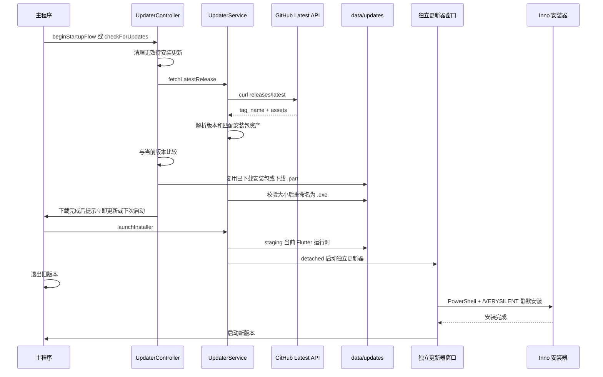

# 更新方案文档

## 文档定位

这份文档记录当前“故事板”项目的软件更新实现方法，目标是把已经跑通的更新链路沉淀成一套可复用技能。后续给其他软件开发更新功能时，可以直接按本文拆模块、改变量、补测试、做发布，减少版本不一致、安装器覆盖失败、下载缓存异常、代理不可用等常见坑。

当前项目类型：

- Flutter Windows 桌面应用。
- Windows 安装包使用 Inno Setup 构建。
- 更新包通过公开 GitHub Release 分发。
- 客户端通过 GitHub Latest Release API 检测新版本。
- 下载后支持用户确认更新、下次启动更新、自动更新。

当前版本状态：

- `pubspec.yaml`：`version: 1.0.0+47`
- `AppUpdateConfig.currentVersion`：`1.0.0.47`
- `AppUpdateConfig.currentVersionTag`：`v1.0.0.47`
- Inno Setup：`#define MyAppVersion "1.0.0.47"`
- GitHub Release 仓库：`https://github.com/luojiang419/storyboard-grid-app-releases`

## 一、任务目标

把软件更新拆成两条链路：

- 运行时链路：客户端启动或手动点击“检查更新”后，检测 GitHub Release、下载安装包、缓存待安装状态、拉起独立更新器、静默安装并重启。
- 发布链路：每次功能完成后，递增版本号、构建 Windows release、用 Inno 打包、发布 GitHub Release、验证 latest API 返回正确资产。

这两条链路必须共同满足：

- 版本号在 Flutter、应用内更新配置、安装包脚本中完全一致。
- 安装包资产名能被客户端自动匹配。
- 下载包大小和 GitHub 资产大小一致。
- 更新安装不依赖正在运行的主程序自身覆盖自身。
- 安装失败时有日志和可重试路径。

## 二、模块清单

### 当前项目文件

| 模块 | 文件 | 责任 |
| --- | --- | --- |
| 更新常量 | `lib/features/updater/domain/app_update_config.dart` | 应用名、当前版本、Release 仓库、安装包基础名、更新器启动参数 |
| 更新模型 | `lib/features/updater/domain/update_models.dart` | Release 信息、更新会话、进度事件、控制器状态 |
| 更新服务 | `lib/features/updater/data/updater_service.dart` | 版本解析、GitHub API、代理、下载、独立更新器、静默安装 |
| 更新控制器 | `lib/features/updater/application/updater_controller.dart` | 启动检查、复用缓存、下载后提示、立即安装、下次启动安装 |
| 更新进度窗口 | `lib/features/updater/presentation/app_updater_page.dart` | 独立更新器 UI，显示安装步骤和错误状态 |
| 应用入口 | `lib/main.dart` | 区分正常启动和更新器会话启动 |
| 应用壳 | `lib/app/app_shell.dart` | 启动后台检查，并在下载完成后弹出确认框 |
| 设置页 | `lib/features/settings/presentation/settings_page.dart` | 更新来源、自动更新开关、代理模式、检查更新、立即更新 |
| 设置模型 | `lib/features/settings/domain/app_settings.dart` | 更新下载模式、仓库地址、代理地址、自动更新配置 |
| 设置存储 | `lib/features/settings/data/settings_repository.dart` | 持久化更新配置、待安装包、已下载版本、下次启动更新标记 |
| 数据目录 | `lib/core/services/app_directories.dart` | `data/updates` 更新缓存和会话日志目录 |
| 安装脚本 | `installer/storyboard_grid_app.iss` | 安装包版本、输出文件名、安装目录、静默安装兼容参数 |
| 服务测试 | `test/features/updater_service_test.dart` | 版本解析、资产名匹配、Release 解析、代理、更新会话参数 |
| 控制器测试 | `test/features/updater_controller_test.dart` | 下载后确认、自动更新、下次启动更新、旧缓存替换 |
| 设置页测试 | `test/widget_test.dart` | 软件更新区 UI 和默认行为 |

### 迁移到其他项目时需要准备的变量

| 变量 | 示例 | 说明 |
| --- | --- | --- |
| 应用显示名 | `故事板` | 窗口标题、安装器名称、提示文案 |
| 可执行文件名 | `storyboard_grid_app.exe` | Inno `[Files]`、`[Icons]`、重启路径 |
| 安装包基础名 | `StoryboardGridApp-Setup` | GitHub asset 匹配使用 |
| 当前版本 | `1.0.0.47` | 应用内比较版本 |
| 当前 tag | `v1.0.0.47` | GitHub Release tag |
| Release 仓库 | `owner/repo` 或 GitHub URL | 必须能转换到 `/releases/latest` API |
| 更新缓存目录 | `data/updates/windows` | 保存安装包、临时运行时、安装日志 |
| 构建命令 | `D:\flutter\bin\flutter.bat build windows --release` | 由项目技术栈决定 |
| 打包命令 | `ISCC.exe installer\xxx.iss` | Windows 当前使用 Inno Setup |

## 三、运行时更新链路

### 总流程



### 1. 启动检查

入口在 `AppShell.initState`：

- 应用界面初始化后调用 `UpdaterController.beginStartupFlow()`。
- 首次启动流程只允许执行一次，避免重复检查和重复下载。
- 启动检查会先清理过期或丢失的待安装更新。
- 如果没有配置有效 Release 仓库，会尝试显示已有待安装包，否则提示配置仓库。

手动检查入口在设置页：

- 用户在“软件更新”区点击“检查更新”。
- 点击前先保存仓库地址、代理模式、手动代理。
- 手动检查下载完成后一定显示确认提示，不会直接走“下次启动更新”逻辑。

### 2. Release 地址解析

`UpdaterService.latestReleaseApiUrlForSource` 支持以下输入：

- `owner/repo`
- `https://github.com/owner/repo`
- `https://github.com/owner/repo/releases/latest`
- `https://api.github.com/repos/owner/repo/releases/latest`

最终统一转换为：

```text
https://api.github.com/repos/{owner}/{repo}/releases/latest
```

注意：

- 当前实现只支持 GitHub 公开仓库。
- 如果后续要支持私有仓库，需要在 `curl` 请求里加入 token header，并处理 token 存储。
- `releases/latest` 不会返回草稿版本；预发布版本是否成为 latest 由 GitHub 规则决定，正式分发建议不要标记 prerelease。

### 3. 版本规范

当前项目采用“四段发布版本”：

- Flutter 版本写法：`1.0.0+47`
- 应用内版本写法：`1.0.0.47`
- GitHub tag 写法：`v1.0.0.47`
- 安装包版本写法：`1.0.0.47`

对应关系：

```text
pubspec.yaml: 1.0.0+46
AppUpdateConfig.currentVersion: 1.0.0.46
AppUpdateConfig.currentVersionTag: v1.0.0.46
installer MyAppVersion: 1.0.0.46
Release tag: v1.0.0.46
Asset: StoryboardGridApp-Setup-1.0.0.46.exe
```

`UpdaterService.normalizeVersionTag` 会处理：

- `v1.2.3` 转为 `v1.2.3`
- `1.2.3+4` 转为 `v1.2.3`
- `1.2` 补齐为 `v1.2.0`
- `v1.2.3.4` 保留四段

`compareVersionTags` 会把版本补齐到四段后逐段比较，因此 `v1.0.0` 和 `v1.0.0.0` 相等。

### 4. 安装包资产匹配

Windows 平台当前允许两种资产名：

```text
StoryboardGridApp-Setup-v1.0.0.43.exe
StoryboardGridApp-Setup-1.0.0.43.exe
```

当前 Inno Setup 输出的是无 `v` 版本：

```iss
OutputBaseFilename=StoryboardGridApp-Setup-{#MyAppVersion}
```

所以实际发布资产为：

```text
StoryboardGridApp-Setup-1.0.0.43.exe
```

避坑：

- Release tag 可以带 `v`，安装包文件名可以不带 `v`。
- 客户端解析 latest release 时会按当前平台和版本号匹配资产名。
- 如果资产名多一个空格、中文后缀、架构后缀，而代码没有同步放行，就会报“缺少当前平台更新包”。
- 给其他项目复用时，先确定资产命名规则，再写测试锁住。

### 5. 代理与网络请求

当前实现使用 `curl.exe`，原因是 Windows 桌面环境中比直接使用 Dart HTTP 更容易配合系统代理和排查网络错误。

三种下载模式：

- `automatic`：读取环境变量代理，并探测本机常用代理端口。
- `manual`：使用用户填写的代理地址。
- `direct`：强制直连，并传 `--noproxy *`。

自动代理候选：

- 环境变量：`HTTPS_PROXY`、`HTTP_PROXY`、`ALL_PROXY` 及小写形式。
- 本机地址：`127.0.0.1`、`localhost`、本机 IPv4。
- 常用 HTTP 端口：`7890`、`7897`、`7899`、`8080`、`10809`、`20171`。
- 常用 SOCKS 端口：`1080`、`10808`。

当前约定代理地址：

```text
http://127.0.0.1:7890
```

避坑：

- 手动代理如果只填 `127.0.0.1:7890`，代码会自动补成 `http://127.0.0.1:7890`。
- 无效代理会提前提示，不要等到下载失败才暴露。
- 自动代理失败后，检查和下载都会 fallback 到直连再试一次。

### 6. 下载与缓存

更新包保存路径：

```text
{安装目录}/data/updates/windows/{asset_name}
```

下载过程：

- 先检查目标安装包是否已存在。
- 如果已存在且大小与 GitHub asset size 一致，直接复用。
- 下载时写入 `.part` 临时文件。
- 下载成功后校验文件存在、大小大于 0、大小等于 GitHub asset size。
- 校验通过后删除旧目标文件，并把 `.part` 重命名为正式 `.exe`。
- 下载失败或大小不一致时删除 `.part`，避免下次误用坏包。

持久化状态：

- `downloadedUpdateVersion`：已下载版本。
- `pendingUpdateVersion`：待安装版本。
- `pendingUpdateInstallerPath`：待安装包路径。
- `dismissedUpdatePromptVersion`：用户选择“下次启动更新”的版本。

避坑：

- 待安装包必须同时满足版本比当前高、文件存在、资产名符合规则。
- 如果待安装包版本已经小于等于当前版本，启动时必须清理。
- 如果待安装包文件被用户删除，启动时必须清理。
- 如果最新 Release 比本地 pending 更新，必须替换旧 pending，避免安装旧版本。

### 7. 下载完成后的策略

下载完成后由 `UpdaterController._setReadyAndMaybeInstall` 决定下一步：

- 自动更新开启：直接拉起安装流程。
- 用户之前选择过“下次启动更新”：启动检查时直接安装。
- 手动检查：只提示，不自动执行下次启动逻辑。
- 自动更新关闭且未安排下次启动：弹窗让用户选“立即更新”或“下次启动更新”。

主界面弹窗来自 `AppShell._showUpdateReadyDialog`：

- “立即更新”：调用 `installPendingUpdateNow()`。
- “下次启动更新”：记录 `dismissedUpdatePromptVersion`。
- 关闭弹窗或异常返回：也按下次启动更新处理。

### 8. 独立更新器

不能让正在运行的主程序直接覆盖自己，因此当前项目采用“复制一份临时 Flutter 运行时作为更新器”的方案。

`launchInstaller` 做的事：

- 确认是 Windows。
- 确认安装包存在。
- 获取当前安装目录：`File(Platform.resolvedExecutable).parent.path`。
- 在 `data/updates/windows/staging/{session}_runtime` 中创建临时运行时。
- 复制当前安装目录下的顶层文件。
- 复制 Flutter 运行所需的 `data/app.so`、`data/icudtl.dat`、`data/flutter_assets`。
- detached 启动临时 exe，并传入更新会话参数。

会话参数：

```text
--run-update-session={sessionId}
--update-version={versionTag}
--update-installer={installerPath}
--update-install-root={appDir}
--update-old-pid={pid}
```

`main.dart` 在启动时先解析这些参数：

- 如果存在完整更新会话，启动 `AppUpdaterPage`。
- 否则正常启动主应用。

避坑：

- 临时更新器必须 detached 启动，否则主程序退出会影响更新器。
- 更新器的数据目录必须指向真实安装目录，而不是 staging 目录，否则日志和缓存会分散。
- staging 目录可以在下次更新前删除重建，不要作为长期状态来源。

### 9. 静默安装与重启

`runUpdaterSession` 的步骤：

1. 准备安装。
2. 等待旧版本进程退出。
3. 启动 Inno 静默安装。
4. 等待新版 exe 可用。
5. 启动新版主程序。

PowerShell 安装脚本关键点：

- 使用 UTF-8 BOM 写入，避免中文日志乱码。
- `Start-Process -Verb RunAs -Wait -PassThru` 用于管理员权限安装并等待结束。
- Inno 参数包含：
  - `/SP-`
  - `/VERYSILENT`
  - `/SUPPRESSMSGBOXES`
  - `/NORESTART`
  - `/NOCANCEL`
  - `/CLOSEAPPLICATIONS`
  - `/FORCECLOSEAPPLICATIONS`
  - `/DIR="{当前安装目录}"`
  - `/LOG="{installer.log}"`

日志位置：

```text
{安装目录}/data/updates/windows/sessions/{sessionId}/installer.log
{安装目录}/data/updates/windows/sessions/{sessionId}/updater.log
```

Inno 脚本里 `[Run]` 使用：

```iss
Flags: nowait postinstall skipifsilent
```

这样静默更新时不会由安装器自己启动程序，而是交给独立更新器在确认安装完成后启动新版。

## 四、发布链路

### 1. 发布前备份与快照

每个功能阶段开始前，在 `backup` 中新增递增编号文档，记录：

- 阶段目标。
- 修改前涉及模块。
- 修改前关键代码或配置。
- 待执行事项。

每完成一个功能模块，在 `进度快照` 中新增递增编号文档，记录：

- 已完成内容。
- 当前修改到哪个模块。
- 具体代码前后对比。
- 验证结果。
- 未完成待办。
- 下一步要做什么。

### 2. 递增版本号

每次发布必须同步改 3 处：

```yaml
# pubspec.yaml
version: 1.0.0+46
```

```dart
// lib/features/updater/domain/app_update_config.dart
static const currentVersion = '1.0.0.46';
static const currentVersionTag = 'v1.0.0.46';
```

```iss
; installer/storyboard_grid_app.iss
#define MyAppVersion "1.0.0.46"
```

版本号搜索检查：

```powershell
rg -n "1\.0\.0\+43|1\.0\.0\.43|v1\.0\.0\.43" pubspec.yaml lib installer test README.md
```

预期：除历史快照、备份、dist 旧安装包外，源码和安装脚本中不应残留旧版本号。

新版本号搜索：

```powershell
rg -n "1\.0\.0\+44|1\.0\.0\.44|v1\.0\.0\.44" pubspec.yaml lib installer test README.md
```

预期至少命中：

- `pubspec.yaml`
- `lib/features/updater/domain/app_update_config.dart`
- `installer/storyboard_grid_app.iss`

### 3. 运行验证

基础验证：

```powershell
D:\flutter\bin\flutter.bat analyze
D:\flutter\bin\flutter.bat test -r expanded
```

更新模块重点测试：

```powershell
D:\flutter\bin\flutter.bat test test\features\updater_service_test.dart -r expanded
D:\flutter\bin\flutter.bat test test\features\updater_controller_test.dart -r expanded
```

如果只改更新设置 UI，也需要覆盖：

```powershell
D:\flutter\bin\flutter.bat test test\widget_test.dart --plain-name "设置页软件更新区默认关闭自动更新开关" -r expanded
```

### 4. Windows release 构建

常规构建：

```powershell
D:\flutter\bin\flutter.bat build windows --release
```

如果中文路径导致 MSBuild、CMake 或编译日志编码异常，使用 ASCII Junction 构建：

```powershell
New-Item -ItemType Junction -Path "G:\data\app\storyboard_ascii_build_link" -Target "G:\data\app\故事板"
Push-Location "G:\data\app\storyboard_ascii_build_link"
D:\flutter\bin\flutter.bat build windows --release
Pop-Location
```

构建后重点检查：

- `build/windows/x64/runner/Release/storyboard_grid_app.exe`
- `build/windows/x64/runner/Release/data/app.so`
- `build/windows/x64/runner/Release/data/flutter_assets`

当前项目发布快照中使用 `app.so` 大小和更新时间确认构建产物已更新，避免装到旧版本。

### 5. Inno Setup 打包

打包命令：

```powershell
& "C:\Program Files (x86)\Inno Setup 6\ISCC.exe" "installer\storyboard_grid_app.iss"
```

输出路径：

```text
dist/installer/StoryboardGridApp-Setup-1.0.0.46.exe
```

校验文件大小与 SHA256：

```powershell
Get-Item "dist\installer\StoryboardGridApp-Setup-1.0.0.46.exe" | Select-Object Name,Length,LastWriteTime
Get-FileHash "dist\installer\StoryboardGridApp-Setup-1.0.0.46.exe" -Algorithm SHA256
```

避坑：

- Inno 的 `#define MyAppVersion` 决定输出安装包名。
- 安装包名必须和 `UpdaterService.expectedInstallerNames` 兼容。
- 打包前必须先完成 Flutter release 构建，否则安装包会打进旧产物。

### 6. GitHub Release 发布

发布前先确认 tag 不存在：

```powershell
gh release view "v1.0.0.46" --repo "luojiang419/storyboard-grid-app-releases"
```

如果不存在，再创建：

```powershell
gh release create "v1.0.0.46" `
  "dist\installer\StoryboardGridApp-Setup-1.0.0.46.exe" `
  --repo "luojiang419/storyboard-grid-app-releases" `
  --title "故事板 v1.0.0.46" `
  --notes "本版本更新内容..."
```

如果不用 `gh`，也可以在 GitHub 网页创建 Release，但必须保证：

- tag：`v1.0.0.46`
- release 标题：`故事板 v1.0.0.46`
- 上传资产：`StoryboardGridApp-Setup-1.0.0.46.exe`
- 非 draft。
- 正式分发时不要勾选 prerelease。

### 7. Latest API 验证

用 PowerShell 验证：

```powershell
$latest = Invoke-RestMethod "https://api.github.com/repos/luojiang419/storyboard-grid-app-releases/releases/latest"
$latest.tag_name
$latest.name
$latest.draft
$latest.prerelease
$latest.assets | Select-Object name,size,digest,browser_download_url
```

预期：

```text
tag_name=v1.0.0.46
draft=False
prerelease=False
asset_name=StoryboardGridApp-Setup-1.0.0.46.exe
asset_url=https://github.com/luojiang419/storyboard-grid-app-releases/releases/download/v1.0.0.46/StoryboardGridApp-Setup-1.0.0.46.exe
```

客户端依赖 `tag_name` 和 `assets[].browser_download_url`，所以这一步必须做。

### 8. 端到端升级验证

最可靠验收方式：

1. 安装旧版本，例如 `v1.0.0.43`。
2. 发布新版本，例如 `v1.0.0.46`。
3. 打开旧版本客户端。
4. 等启动后台检查，或进入设置页点击“检查更新”。
5. 确认检测到新版本并下载。
6. 自动更新关闭时，确认弹窗出现。
7. 点击“立即更新”。
8. 确认独立更新窗口出现。
9. 允许管理员权限。
10. 确认旧版本退出、新版本启动。
11. 查看窗口标题或设置页当前版本为新 tag。
12. 验证本次功能改动真实生效。

## 五、可复用技能模板

后续给其他软件实现更新时，可以按以下顺序执行。

### Step 1：定义更新契约

必须先确认：

- 应用是否需要自更新。
- 目标平台是什么。
- 发布渠道是什么。
- 安装包格式是什么。
- 版本号格式是什么。
- 客户端是否能访问 Release API。
- 是否需要代理。
- 更新时是否需要管理员权限。

不要一开始就写 UI。先把“版本来源、资产命名、安装方式”定死。

### Step 2：建立版本配置模块

建议创建：

```text
features/updater/domain/app_update_config.*
features/updater/domain/update_models.*
```

配置里至少包含：

- appName
- userAgent
- currentVersion
- currentVersionTag
- installerBaseName
- defaultReleaseRepositoryUrl
- updater session args
- relaunch delay

验收：

- 单元测试能从项目版本文件和安装脚本读取版本，并确认三者一致。

### Step 3：实现 Release 解析服务

服务能力：

- 把用户输入的仓库地址转换成 latest API。
- 请求 latest API。
- 解析 tag。
- 找到当前平台安装包资产。
- 读取下载 URL 和 size。
- 比较最新版本和当前版本。

验收：

- 支持 `owner/repo`、GitHub URL、API URL。
- 缺失资产时给出明确错误。
- 资产名大小写不敏感。
- 版本比较覆盖三段和四段。

### Step 4：实现下载服务

服务能力：

- 按平台写入更新缓存目录。
- 复用已下载且大小一致的安装包。
- 使用 `.part` 防止坏包被当成正式安装包。
- 下载完成后校验大小。
- 支持代理和直连 fallback。

验收：

- 下载失败会删除 `.part`。
- size 不一致会删除 `.part`。
- 已有完整安装包不会重复下载。
- 无代理可直连，代理失败可 fallback。

### Step 5：实现状态控制器

控制器能力：

- 启动检查只执行一次。
- 手动检查可重复触发，但忙碌中要提示。
- 清理失效 pending 更新。
- 下载完成后写入 pending。
- 自动更新开关生效。
- 下次启动更新标记生效。
- 安装失败后保留安装包，用户可以重试。

验收：

- 默认下载完成等待用户确认。
- 自动更新开启时直接拉起安装。
- 选择下次启动后，下一次启动会安装。
- 新 release 会替换旧 pending。

### Step 6：实现独立更新器

Windows 桌面应用建议使用独立更新器窗口：

- 主程序下载包。
- 主程序复制一份可运行的临时 runtime。
- 临时 runtime detached 启动。
- 主程序退出。
- 临时 runtime 执行安装器。
- 安装完成后启动新版主程序。

验收：

- 主程序退出后更新器仍继续运行。
- 更新器能等待旧进程退出。
- 安装器能写入原安装目录。
- 更新器日志可追踪。
- 安装完成后新版能启动。

### Step 7：接入 UI

UI 最小集：

- 当前版本展示。
- Release 仓库地址。
- 自动更新开关。
- 下载模式：自动代理、手动代理、直连。
- 手动代理输入。
- 检查更新按钮。
- 立即更新按钮。
- 状态和进度显示。
- 下载完成确认弹窗。
- 独立更新进度窗口。

验收：

- 自动更新默认关闭。
- 手动检查下载完成后必须有确认。
- 状态文案能说明当前阶段。
- 更新失败时用户知道下一步怎么做。

### Step 8：发布与验证

每次发布必须执行：

- 备份修改前状态。
- 递增版本号。
- 搜索旧版本号残留。
- 跑 analyze。
- 跑测试。
- 构建 release。
- 打包安装器。
- 计算 SHA256。
- 发布 GitHub Release。
- 验证 latest API。
- 用旧版本客户端端到端升级。
- 写进度快照。

## 六、验收标准

### 代码层

- `pubspec.yaml`、`AppUpdateConfig`、Inno 版本完全一致。
- 最新 Release tag 大于当前版本时，客户端能检测到。
- 最新 Release 缺少匹配安装包时，客户端能给出明确错误。
- 下载包大小校验通过后才进入 pending。
- pending 更新不会在当前版本或文件丢失时残留。
- 自动更新、下次启动更新、手动立即更新都能区分。
- 独立更新器能在主程序退出后继续安装。

### 发布层

- Release tag 和标题正确。
- 安装包资产名符合客户端匹配规则。
- GitHub Latest API 返回新 tag 和正确资产。
- 安装包 SHA256 已记录。
- 发布快照包含构建、打包、API 验证结果。

### 用户体验层

- 用户能看到当前版本。
- 用户能手动检查更新。
- 下载完成后不会无提示强制重启，除非主动开启自动更新。
- 更新窗口能显示阶段进度。
- 失败时安装包保留，用户可以重试。

## 七、常见坑与规避

### 1. 版本号只改了一处

表现：

- GitHub Release 已发布，但客户端认为自己已经是最新。
- 安装包文件名是新版本，应用标题还是旧版本。
- 测试里 `current version matches pubspec build and installer version` 失败。

规避：

- 每次发布固定改三处。
- 用 `rg` 搜旧版本号。
- 保留版本一致性测试。

### 2. Release 资产名不匹配

表现：

- latest API 能返回新版本。
- 客户端提示缺少当前平台更新包。

规避：

- 安装包基础名和版本名必须与 `expectedInstallerNames` 一致。
- 发布后用 latest API 看 `assets[].name`。
- 如需加入架构后缀，例如 `x64`，先改代码和测试，再发布。

### 3. 下载了坏包

表现：

- 安装器打不开。
- 下载中断后仍被当成完整包。

规避：

- 只下载到 `.part`。
- 校验 size 后再 rename。
- 失败删除 `.part`。

### 4. 主程序覆盖自身失败

表现：

- 安装器提示文件被占用。
- 更新流程卡在安装阶段。

规避：

- 用 staged runtime 拉起独立更新器。
- 主程序拉起更新器后退出。
- Inno 使用 `/CLOSEAPPLICATIONS` 和 `/FORCECLOSEAPPLICATIONS`。

### 5. 静默安装后启动了两次

表现：

- 安装器启动一次，更新器又启动一次。

规避：

- Inno `[Run]` 加 `skipifsilent`。
- 静默更新时只允许更新器负责重启。

### 6. 安装到了默认目录而不是原目录

表现：

- 更新后用户原目录仍是旧版本。
- 新版本被安装到另一个默认路径。

规避：

- 静默安装必须传 `/DIR="{当前安装目录}"`。
- 当前安装目录来自旧进程的 `Platform.resolvedExecutable`。

### 7. 代理导致检查失败

表现：

- 用户网络正常，但 GitHub API 访问失败。
- 手动代理格式错误。

规避：

- 自动探测常见代理端口。
- 手动代理做格式校验。
- 代理失败 fallback 直连。
- 文档中明确默认代理：`http://127.0.0.1:7890`。

### 8. 中文路径构建异常

表现：

- Windows 构建阶段出现路径编码、MSBuild 或 CMake 异常。

规避：

- 使用 ASCII Junction 构建。
- 构建完成后仍在原项目目录打包，确保产物路径一致。

### 9. 最新包已下载但用户看不到提示

表现：

- pending 存在，但不弹窗。

规避：

- 区分 `readyFromManualCheck` 和启动检查。
- 用户选择“下次启动更新”时记录 `dismissedUpdatePromptVersion`。
- 如果用户手动检查，应重新提示。

### 10. 安装失败没有线索

表现：

- 用户只看到失败，开发者无法判断原因。

规避：

- PowerShell 更新脚本写 `updater.log`。
- Inno 写 `installer.log`。
- 错误状态保留安装包路径，便于重试。

## 八、回滚与应急处理

如果发布错版本：

- 如果客户端还未检测，删除 GitHub Release 或取消 latest 状态。
- 如果客户端已检测并版本号更高，推荐发布一个更高版本修复，不要尝试让客户端降级。

如果资产名错了：

- 可以在同一个 Release 补传正确资产。
- 补传后重新验证 latest API。
- 客户端下一次检查会重新解析资产。

如果安装包内容是旧构建：

- 递增版本号重新构建和发布。
- 不建议覆盖同名资产后继续使用同 tag，因为客户端可能已经缓存了旧包。

如果用户更新失败：

- 让用户重新打开旧版本。
- 进入设置页点击“立即更新”或“检查更新”。
- 查看：
  - `data/updates/windows/sessions/{sessionId}/updater.log`
  - `data/updates/windows/sessions/{sessionId}/installer.log`

如果下载缓存损坏：

- 删除 `data/updates/windows/*.part`。
- 删除对应错误 `.exe`。
- 重新检查更新。

## 九、发布命令速查

以下以从 `v1.0.0.45` 发布到 `v1.0.0.46` 为例。

```powershell
# 1. 检查旧版本号残留
rg -n "1\.0\.0\+43|1\.0\.0\.43|v1\.0\.0\.43" pubspec.yaml lib installer test README.md

# 2. 检查新版本号命中
rg -n "1\.0\.0\+44|1\.0\.0\.44|v1\.0\.0\.44" pubspec.yaml lib installer test README.md

# 3. 静态检查和测试
D:\flutter\bin\flutter.bat analyze
D:\flutter\bin\flutter.bat test -r expanded

# 4. Windows release 构建
D:\flutter\bin\flutter.bat build windows --release

# 5. Inno Setup 打包
& "C:\Program Files (x86)\Inno Setup 6\ISCC.exe" "installer\storyboard_grid_app.iss"

# 6. 安装包校验
Get-Item "dist\installer\StoryboardGridApp-Setup-1.0.0.46.exe" | Select-Object Name,Length,LastWriteTime
Get-FileHash "dist\installer\StoryboardGridApp-Setup-1.0.0.46.exe" -Algorithm SHA256

# 7. 创建 GitHub Release
gh release create "v1.0.0.46" `
  "dist\installer\StoryboardGridApp-Setup-1.0.0.46.exe" `
  --repo "luojiang419/storyboard-grid-app-releases" `
  --title "故事板 v1.0.0.46" `
  --notes "本版本更新内容..."

# 8. 验证 latest API
$latest = Invoke-RestMethod "https://api.github.com/repos/luojiang419/storyboard-grid-app-releases/releases/latest"
$latest.tag_name
$latest.assets | Select-Object name,size,digest,browser_download_url

# 9. 清理不再使用的 Flutter 临时构建缓存
Remove-Item -LiteralPath ".dart_tool\flutter_build" -Recurse -Force -ErrorAction SilentlyContinue
```

## 十、给其他项目复用时的最小交付清单

必须交付：

- 更新配置模块。
- Release 解析和下载服务。
- 更新控制器。
- 设置页更新配置区。
- 下载完成确认弹窗。
- 独立更新器入口。
- 安装器静默安装脚本。
- 版本一致性测试。
- Release 解析测试。
- 下载缓存测试。
- 自动更新和下次启动更新测试。
- 发布操作文档。

可以后续增强：

- 多平台安装包资产匹配。
- 私有 Release 仓库 token。
- 增量更新。
- 安装包签名验证。
- SHA256 强校验。
- 更新通道：stable、beta、nightly。
- 下载限速和取消下载。
- 自动清理旧版本安装包。

## 十一、本项目后续优化建议

当前方案已经能完成 Windows 端自动更新，后续如果继续增强，建议按优先级处理：

1. 增加安装包 SHA256 校验。GitHub asset size 只能防止明显截断，不能防止同大小内容错误。
2. 增加旧更新缓存清理策略。保留当前 pending，删除更旧版本安装包和 staging 目录。
3. 给 latest API 请求增加更明确的超时和错误分类展示。
4. 把 GitHub Release 发布命令整理成脚本，减少手工发布出错。
5. 如果要支持私有仓库，新增 token 配置和安全存储，不能把 token 写死在源码。
