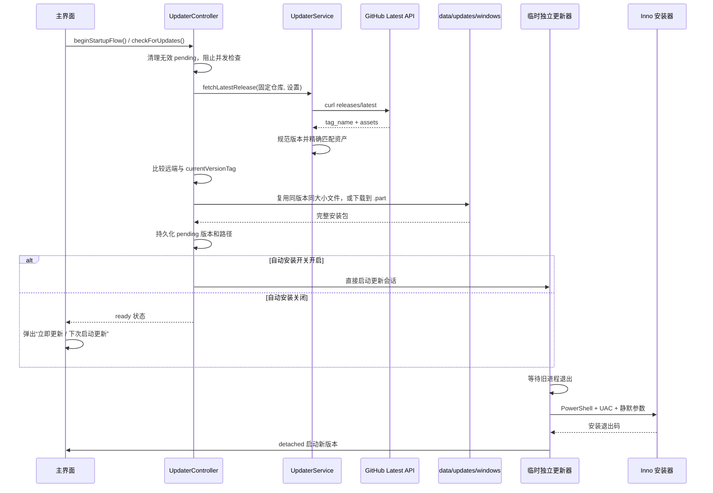

# 自动更新方案

## 1. 文档定位

本文基于“故事板”当前源码整理，目标是把已经运行和发布验证过的 Windows 自动更新链路沉淀成一套可迁移方案，供其他桌面软件直接复用开发。

本文分为两类内容：

- **当前实现**：准确描述本项目 v1.0.0.87 的实际行为和源码位置。
- **复用要求**：迁移到其他软件时必须同时采用三态更新策略和三态网络模式，并补齐完整性校验、CI 发布和验收要求。这些要求不代表当前项目已经全部实现。

基准信息：

| 项目 | 当前值 |
| --- | --- |
| 客户端技术栈 | Flutter Windows |
| 安装器 | Inno Setup |
| 当前版本 | `1.0.0.87` / `v1.0.0.87` |
| Flutter 版本字段 | `version: 1.0.0+87` |
| Release 仓库 | `luojiang419/storyboard-grid-app-releases` |
| Latest API | `https://api.github.com/repos/luojiang419/storyboard-grid-app-releases/releases/latest` |
| Windows 资产名 | `StoryboardGridApp-Setup-1.0.0.87.exe` |
| 更新缓存 | `{安装目录}/data/updates/windows` |
| 本地 v1.0.0.87 安装包 SHA-256 | `ABB0C89584A24F174DBE6EA136D316AF56BB02EE0575C38E1E0025A350FBB9FE` |
| 当前签名状态 | 未进行 Authenticode 数字签名 |

> 重要语义：当前设置页的“自动更新”开关实际控制“下载完成后是否不经确认直接安装”，并不控制启动检测。开关关闭时，软件仍会在启动后检查并下载更新，然后弹出确认框。网络区的“自动检测代理 / 手动代理 / 直连”只是下载网络模式，也不是更新策略。

## 2. 任务目标与验收标准

一套可复用的更新系统应覆盖两条链路：

1. **客户端运行时链路**：检测版本、精确选择资产、下载、校验、持久化待安装状态、提示用户、退出旧进程、安装并重启。
2. **发布链路**：统一版本、测试、构建、打包、校验、创建正式 GitHub Release，并保证客户端可以匹配资产。

最终验收标准：

- 本地运行时版本、GitHub tag、安装包产品版本和资产文件名使用同一个版本。
- 启动检测和手动检测均能区分“有更新、无更新、网络失败、资产缺失”。
- Release 中存在多个资产时，客户端只能精确匹配本平台的唯一资产。
- 下载中断不会留下可被误安装的正式文件。
- 弹窗不会重复出现，不会与首次使用引导等全局遮罩冲突。
- 用户可以“立即更新”或“下次启动更新”。
- 安装时旧进程已经退出，更新器仍能独立显示进度并在成功后重启新版。
- 发布资产经过大小、SHA-256 和签名策略校验。
- 真实旧版本可以通过 Latest Release 完成端到端升级。

## 3. 当前模块清单

| 模块 | 当前文件 | 责任 |
| --- | --- | --- |
| 更新常量 | `lib/features/updater/domain/app_update_config.dart` | 应用名、当前版本、仓库、安装包基础名、更新会话参数 |
| 更新模型 | `lib/features/updater/domain/update_models.dart` | Release、安装会话、进度事件和控制器状态 |
| 更新服务 | `lib/features/updater/data/updater_service.dart` | GitHub API、版本比较、资产匹配、代理、下载、独立更新器、静默安装 |
| 更新控制器 | `lib/features/updater/application/updater_controller.dart` | 启动/手动检查、缓存复用、状态持久化、提示条件和安装决策 |
| 更新进度窗口 | `lib/features/updater/presentation/app_updater_page.dart` | 显示准备、退出、安装、重启、完成或失败状态 |
| 应用入口 | `lib/main.dart` | 正常应用与独立更新会话分流 |
| 应用壳 | `lib/app/app_shell.dart` | 启动检查、监听更新状态、显示更新确认弹窗 |
| 设置模型 | `lib/features/settings/domain/app_settings.dart` | 自动安装开关和网络模式 |
| 设置存储 | `lib/features/settings/data/settings_repository.dart` | 设置及待安装状态持久化 |
| 设置界面 | `lib/features/settings/presentation/settings_page.dart` | 当前版本、自动安装、代理、检查更新、立即更新和状态进度 |
| 依赖注入 | `lib/core/providers/app_providers.dart` | 创建并共享 Service、Controller |
| 更新目录 | `lib/core/services/app_directories.dart` | 创建 `data/updates` |
| 安装器 | `installer/storyboard_grid_app.iss` | 安装目录、版本、资产名、覆盖文件和静默运行行为 |
| 服务测试 | `test/features/updater_service_test.dart` | 版本、地址、资产、代理、会话参数和更新器启动测试 |
| 控制器测试 | `test/features/updater_controller_test.dart` | 启动检查、手动检查、确认、自动安装、延期安装和旧缓存替换 |
| 设置测试 | `test/core/app_database_test.dart`、`test/widget_test.dart` | 默认值、持久化和设置页交互 |

迁移时建议保持同样的 `domain / data / application / presentation` 分层。界面不应直接请求 GitHub，也不应直接启动安装器。

## 4. 固定更新契约

发布端和客户端必须先共同固定以下契约，再开发 UI。

### 4.1 版本契约

当前项目使用四段发布版本：

```text
pubspec.yaml                   1.0.0+87
AppUpdateConfig.currentVersion 1.0.0.87
客户端 tag                     v1.0.0.87
Inno AppVersion                1.0.0.87
GitHub Release tag             v1.0.0.87
安装包                          StoryboardGridApp-Setup-1.0.0.87.exe
```

`test/features/updater_service_test.dart` 已锁定这三个源码版本入口的一致性：

- 从 `pubspec.yaml` 的 `1.0.0+87` 推导 `1.0.0.87`。
- `AppUpdateConfig.currentVersion` 必须等于推导结果。
- `AppUpdateConfig.currentVersionTag` 必须等于 `v` 加推导结果。
- Inno `MyAppVersion` 必须等于推导结果。

当前版本工具支持一至四段纯数字，并统一添加 `v`：

```text
v1.2.3     -> v1.2.3
1.2        -> v1.2.0
v1.2.3.4   -> v1.2.3.4
1.2.3+4    -> v1.2.3
```

比较时会补齐到四段，所以 `v1.0.0` 与 `v1.0.0.0` 相等。

注意：`1.2.3+4` 中的 `+4` 会被丢弃，不能直接用该函数把 Flutter build number 转成第四段。其他项目应只选一种明确规则：标准 SemVer，或像当前项目一样显式生成四段版本；不要混用。

### 4.2 Release 和资产契约

当前控制器固定使用：

```text
https://github.com/luojiang419/storyboard-grid-app-releases
```

服务会转换成：

```text
https://api.github.com/repos/luojiang419/storyboard-grid-app-releases/releases/latest
```

地址解析器也支持 `owner/repo`、普通 GitHub 仓库 URL、GitHub Latest URL 和 API URL，但当前控制器并不读取用户配置的仓库地址，而是始终传入 `AppUpdateConfig.defaultReleaseRepositoryUrl`。

Windows 资产只允许以下两种精确名称，比较时忽略大小写：

```text
StoryboardGridApp-Setup-v1.0.0.87.exe
StoryboardGridApp-Setup-1.0.0.87.exe
```

Inno 当前生成第二种无 `v` 的名称。不要用“第一个 `.exe`”、包含匹配或模糊版本匹配，否则 Release 中出现调试工具、卸载器或其他架构资产时可能安装错误文件。

### 4.3 安装器契约

当前 Inno 配置的关键点：

- x64 compatible。
- `PrivilegesRequired=admin`，安装时会触发 UAC。
- 默认目录为 `D:\Program Files\故事板`。
- 文件覆盖采用 `ignoreversion`。
- 静默更新时 `[Run]` 的 `skipifsilent` 阻止 Inno 自己拉起应用，由独立更新器统一重启。
- 安装包名由 `OutputBaseFilename=StoryboardGridApp-Setup-{#MyAppVersion}` 生成。

复用时必须替换应用名、AppId、发行者、可执行文件名、默认安装目录、图标、文件关联和资产基础名。AppId 一旦正式发布不要随意改变，否则会被 Windows 视为另一套安装。

## 5. 当前完整更新时序



## 6. 检测机制

### 6.1 启动检测入口

`AppShell.initState` 在首帧后调用 `UpdaterController.beginStartupFlow()`。控制器通过 `_startupFlowStarted` 保证单次进程生命周期内只启动一次检查。

启动时实际顺序：

1. 清理已经不合法的待安装状态。
2. 进入 `checkForUpdates(manual: false)`。
3. 若控制器正在检查或下载，仅更新状态为“正在检查或下载更新，请稍候”，不发起第二个请求。
4. 请求固定 GitHub 仓库的 Latest Release。
5. 远端版本小于等于当前版本时，显示“当前已是最新版本”。
6. 远端版本更高时，优先复用合法 pending 或本地完整安装包，否则开始下载。
7. 下载完成后根据自动安装开关、是否安排过下次启动、是否为手动检查来决定安装或弹窗。

当前启动检测**不受自动安装开关控制**。即使开关关闭，也会检测和下载。

### 6.2 手动检测入口

设置页“检查更新”先保存手动代理，再调用默认的 `checkForUpdates(manual: true)`。

手动检查的特殊语义：

- 下载完成后仍会等待用户确认，不会因为以前选过“下次启动更新”而立即退出应用。
- 如果自动安装开关已经开启，当前控制器仍会直接安装；`manual` 只阻止“已安排下次启动”的自动执行。
- 设置页会显示检查、下载、无更新或错误状态，并在下载中显示线性进度。

### 6.3 Release 解析

服务只读取：

- `tag_name`
- `assets[].name`
- `assets[].browser_download_url`
- `assets[].size`

解析原则：

1. `tag_name` 必须能规范化为纯数字版本。
2. 当前平台必须存在可计算的期望资产名。
3. 遍历 Release 资产并进行精确名称匹配。
4. 下载 URL 不能为空。
5. 没有匹配资产时明确报错，不下载其他 `.exe`。

当前代码没有另外读取 `draft`、`prerelease`，而是依赖 `/releases/latest` 返回正式 Latest Release。其他项目若改用 Releases 列表 API，必须显式过滤草稿和预发布。

### 6.4 网络和代理

当前所有检测和下载使用 Windows 自带的 `curl.exe`。

网络模式：

| 模式 | 行为 |
| --- | --- |
| 自动检测代理 | 读取 `HTTPS_PROXY`、`HTTP_PROXY`、`ALL_PROXY` 等环境变量，再探测本机常用 HTTP/SOCKS 端口 |
| 手动代理 | 校验用户填写的 HTTP、HTTPS、SOCKS4/5 地址 |
| 直连 | 给 curl 传入 `--noproxy *` |

自动探测端口包括 `7890`、`7897`、`7899`、`8080`、`10809`、`20171`、`1080`、`10808`。本项目默认手动地址是 `http://127.0.0.1:7890`。

检测和下载经代理失败时会自动直连重试一次。连接超时为 20 秒；版本请求总超时 60 秒；安装包下载总超时 600 秒。

## 7. 下载、缓存和待安装状态

### 7.1 下载目录

```text
{安装目录}/data/updates/windows/{Release 中的资产名}
```

下载算法：

1. 正式目标文件存在且大小等于 Release 资产大小时直接复用。
2. 下载前删除旧 `.part`。
3. curl 只写入 `{目标名}.part`。
4. 每 350 毫秒根据 `.part` 大小更新下载进度，上限先显示到 98%。
5. 下载退出码必须为 0。
6. `.part` 必须存在且大于 0 字节。
7. Release 提供正数大小时，本地大小必须完全一致。
8. 校验通过后才把 `.part` 重命名成正式 `.exe`，并上报 100%。
9. 失败时删除 `.part`，防止下次误用。

### 7.2 持久化键

| 键 | 用途 |
| --- | --- |
| `downloadedUpdateVersion` | 记录最近下载版本；当前主要用于状态记录 |
| `pendingUpdateVersion` | 待安装版本 |
| `pendingUpdateInstallerPath` | 待安装包绝对路径 |
| `dismissedUpdatePromptVersion` | 实际表示用户把该版本安排到下次启动安装 |

pending 被接受前必须同时满足：

- 版本可解析且高于当前版本。
- 安装包路径存在。
- 文件名与该版本的期望资产名一致。
- 和 Latest Release 对比时，若资产提供正数大小，文件大小也必须一致。

当前版本已经等于或高于 pending、文件被删除、名称非法时，启动会清空 pending 和延期标记。Latest 出现更高版本时，旧 pending 会被替换。

网络请求失败时，控制器会尝试回退到本地合法 pending，使已经下载的更新仍能安装。

## 8. 弹窗提示机制

### 8.1 显示条件

只有以下条件同时满足才显示更新确认弹窗：

- 控制器不忙。
- `readyVersionTag` 和 `readyInstallerPath` 均存在。
- 自动安装开关关闭。
- 本次是手动检查，或该版本尚未安排到下次启动。
- 当前没有其他更新弹窗。
- 首次使用引导没有显示。

`AppShell` 监听控制器状态。首次使用引导显示期间先不弹更新框，引导结束后重新检查 `shouldShowReadyPrompt`，避免两个全局弹层叠加。

### 8.2 当前弹窗文案和交互

```text
标题：更新已下载完成
正文：新版本 {versionTag} 已准备好。可以现在更新并重启故事板，也可以安排到下次启动时更新。
按钮一：下次启动更新
按钮二：立即更新
```

弹窗使用 `barrierDismissible: false`，不能点击遮罩关闭。

- **立即更新**：启动临时更新器窗口，500 毫秒后退出主程序。
- **下次启动更新**：保存该版本到 `dismissedUpdatePromptVersion`，保留安装包，不退出当前程序。
- **意外返回 null**：也按“下次启动更新”处理，避免 ready 状态反复弹窗。

可迁移的 Flutter 结构：

```dart
enum UpdateReadyAction { installNow, nextStartup }

final action = await showDialog<UpdateReadyAction>(
  context: context,
  barrierDismissible: false,
  builder: (context) => AlertDialog(
    title: const Text('更新已下载完成'),
    content: Text(
      '新版本 $versionTag 已准备好。可以现在更新并重启，'
      '也可以安排到下次启动时更新。',
    ),
    actions: [
      TextButton(
        onPressed: () => Navigator.pop(
          context,
          UpdateReadyAction.nextStartup,
        ),
        child: const Text('下次启动更新'),
      ),
      FilledButton(
        onPressed: () => Navigator.pop(
          context,
          UpdateReadyAction.installNow,
        ),
        child: const Text('立即更新'),
      ),
    ],
  ),
);

if (action == UpdateReadyAction.installNow) {
  await updaterController.installPendingUpdateNow();
} else {
  updaterController.installPendingUpdateOnNextStartup();
}
```

### 8.3 当前行为矩阵

| 入口 | 自动安装开关 | 已安排下次启动 | 结果 |
| --- | --- | --- | --- |
| 启动检查 | 关闭 | 否 | 下载完成后弹窗 |
| 启动检查 | 关闭 | 是，同一版本 | 直接进入安装流程 |
| 手动检查 | 关闭 | 任意 | 下载完成后弹窗 |
| 启动或手动检查 | 开启 | 任意 | 下载完成后直接进入安装流程 |
| 任意入口 | 任意 | 无新版本 | 显示当前已是最新版本 |
| 任意入口 | 任意 | 网络失败但有合法 pending | 使用本地 pending |

## 9. 独立更新器与静默安装

正在运行的主程序不能可靠覆盖自身，所以当前项目没有让主窗口直接运行 Inno，而是把现有 Flutter 运行时复制成一个临时独立更新器。

### 9.1 启动临时更新器

`launchInstaller` 执行：

1. 仅允许 Windows 自动安装。
2. 校验安装包存在。
3. 读取当前可执行文件目录作为真实安装目录。
4. 创建唯一 session，例如 `update_时间戳`。
5. 复制安装目录顶层文件，以及 `data/app.so`、`data/icudtl.dat`、`data/flutter_assets` 到：

```text
data/updates/windows/staging/{sessionId}_runtime
```

6. detached 启动 staging 中的同名主程序并传入：

```text
--run-update-session={sessionId}
--update-version={versionTag}
--update-installer={installerPath}
--update-install-root={真实安装目录}
--update-old-pid={旧主程序 PID}
```

7. 主程序确认临时更新器进程成功创建后，延迟 500 毫秒退出。

`main.dart` 在普通初始化之前解析参数。参数完整时只启动 760×500 的更新进度窗口，不打开主业务应用，也不打开业务数据库。

### 9.2 更新进度窗口

当前页面显示五步：

1. 准备安装。
2. 关闭旧版本。
3. 安装新版本。
4. 启动新版本。
5. 完成。

运行中提示用户不要关闭窗口；成功后提示新版已启动并在 2 秒后关闭；失败时保留安装包并提示回到设置页重试。

### 9.3 静默安装命令

独立更新器等待旧 PID 退出，再生成带 UTF-8 BOM 的 PowerShell 脚本，并以隐藏窗口运行。脚本使用：

```text
Start-Process -FilePath {installer} -Verb RunAs -Wait -PassThru
```

Inno 参数：

```text
/SP-
/VERYSILENT
/SUPPRESSMSGBOXES
/NORESTART
/NOCANCEL
/CLOSEAPPLICATIONS
/FORCECLOSEAPPLICATIONS
/DIR="{原安装目录}"
/LOG="{session目录}/installer.log"
```

`RunAs` 会触发 UAC，`Wait` 确保安装结束后才重启新版。安装退出码非 0 时停止流程，不误报完成。

日志位置：

```text
data/updates/windows/sessions/{sessionId}/installer.log
data/updates/windows/sessions/{sessionId}/updater.log
```

当前更新器最多等待旧进程 120 秒；超时后仍会继续尝试安装。它最多等待新版 exe 出现 30 秒；随后启动新版，启动失败由更新页面捕获并显示错误。复用时建议把两类超时变成显式失败，不要在超时后继续覆盖。

## 10. 设置页双维度模型

### 10.1 当前设置页

当前“软件更新”区域提供：

- 当前版本。
- “自动更新”开关；默认关闭，实际含义是“下载完成后直接安装”。
- 自动检测代理、手动代理、直连。
- 手动代理地址。
- 检查更新。
- 保存更新设置。
- 安装包 ready 后显示“立即更新”。
- 状态信息和下载进度。

`updateReleaseApiUrl` 仍存在于设置模型和数据库，但当前界面不展示仓库地址，控制器也不使用该字段。迁移时应二选一：删除这个遗留字段并固定官方仓库，或让控制器真正读取它；不要让 UI、存储和运行行为不一致。

### 10.2 复用方案必须同时保留两个维度

其他软件复用时必须同时实现以下两组设置，不能把它们合并成一组：

1. **更新策略**决定“什么时候检测、下载和提示”：自动更新、手动更新、禁止更新。
2. **网络模式**决定“检测和下载请求通过哪条网络路径”：自动检测代理、手动代理、直连。

建议领域模型：

```dart
enum UpdatePolicy {
  automatic,
  manual,
  disabled,
}

enum UpdateNetworkMode {
  automaticProxy,
  manualProxy,
  direct,
}

class UpdateSettings {
  const UpdateSettings({
    this.policy = UpdatePolicy.automatic,
    this.networkMode = UpdateNetworkMode.automaticProxy,
    this.manualProxyUrl = 'http://127.0.0.1:7890',
  });

  final UpdatePolicy policy;
  final UpdateNetworkMode networkMode;
  final String manualProxyUrl;
}
```

更新策略行为：

| 策略 | 启动检测 | 自动下载 | 下载完成提示 | 手动检查 | 默认 |
| --- | --- | --- | --- | --- | --- |
| 自动更新 | 是 | 是 | “立即更新 / 下次启动更新” | 可用 | 是 |
| 手动更新 | 否 | 用户点击后下载 | 同上 | 可用 | 否 |
| 禁止更新 | 否 | 否 | 不显示 | 禁用或隐藏 | 否 |

网络模式行为：

| 网络模式 | 代理解析 | 请求参数 | 失败回退 |
| --- | --- | --- | --- |
| 自动检测代理 | 环境变量 + 本机地址 + 常见端口探测 | 找到代理时使用 `--proxy`，否则直连 | 代理请求失败后直连重试一次 |
| 手动代理 | 校验用户填写的 HTTP/HTTPS/SOCKS 地址 | 使用 `--proxy {manualProxyUrl}` | 可按产品策略直连重试，或严格失败 |
| 直连 | 不解析代理 | `--noproxy *` | 不切换代理 |

两组设置是正交组合，九种组合都应有确定行为：

| 更新策略 \ 网络模式 | 自动检测代理 | 手动代理 | 直连 |
| --- | --- | --- | --- |
| 自动更新 | 启动自动检查和下载，自动选择可用代理 | 启动自动检查和下载，只使用已配置代理 | 启动自动检查和下载，强制直连 |
| 手动更新 | 仅点击“检查更新”后自动选择可用代理 | 仅点击后使用已配置代理 | 仅点击后强制直连 |
| 禁止更新 | 不发起更新网络请求 | 不发起更新网络请求 | 不发起更新网络请求 |

推荐默认值：

```text
updatePolicy=automatic
updateNetworkMode=automaticProxy
manualProxyUrl=http://127.0.0.1:7890
```

设置页建议按以下顺序显示，避免用户误把代理模式当成更新策略：

1. 当前版本。
2. 更新策略：自动更新 / 手动更新 / 禁止更新。
3. “检查更新”按钮；禁止更新时禁用或隐藏。
4. 网络模式：自动检测代理 / 手动代理 / 直连。
5. 手动代理地址；仅手动代理时启用。
6. 状态、下载进度和 ready 后的“立即更新”。

“是否不经提示直接静默安装”不属于上面两组，应当只作为独立高级设置，例如 `installWithoutConfirmation`，并默认关闭。自动更新的默认语义应是“启动自动检测和下载，下载完成后弹出立即更新 / 下次启动更新”，不能等同于“无提示退出正在工作的软件”。

建议持久化键：

```text
updatePolicy
updateNetworkMode
updateManualProxyUrl
downloadedUpdateVersion
pendingUpdateVersion
pendingUpdateInstallerPath
deferredUpdateVersion
```

控制器先判断更新策略，再由 Service 解析网络模式。更新策略层不得拼接 curl 参数，网络层也不得决定是否在启动时检查。

建议启动门控：

```dart
Future<void> beginStartupFlow() async {
  if (_startupFlowStarted) return;
  _startupFlowStarted = true;

  await reconcilePendingUpdate();
  if (settings.updatePolicy != UpdatePolicy.automatic) return;

  await checkForUpdates(manual: false);
}
```

网络解析建议集中在 Service：

```dart
Future<String> resolveProxyUrl(UpdateSettings settings) async {
  return switch (settings.networkMode) {
    UpdateNetworkMode.direct => '',
    UpdateNetworkMode.manualProxy =>
      validateProxy(settings.manualProxyUrl),
    UpdateNetworkMode.automaticProxy =>
      findFirstReachableProxy(),
  };
}
```

禁止更新时建议只停止新的网络请求和下载，不擅自删除用户已经下载的安装包。重新启用后再校验并恢复 pending。

## 11. 给其他软件的实施步骤

### 模块一：识别项目和安装方式

先确认：

- 目标平台和架构。
- 本地测试、构建、打包命令。
- 安装包格式及静默参数。
- 是否需要管理员权限。
- 运行中的文件能否被覆盖。
- 版本唯一来源。
- 发布仓库、正式分支和资产命名。
- 是否需要代码签名、企业信任或商店审核。

验收：在本地可以通过非交互命令构建真实安装包，并能用静默参数安装到指定目录。

### 模块二：建立配置和领域模型

至少定义：

```text
appName
executableName
currentVersion
currentVersionTag
releaseRepository
platformKey
architecture
installerBaseName
updatePolicy
pendingUpdate
updateSession
updateProgress
```

验收：版本一致性测试可以从项目版本源推导出运行时版本、tag 和安装器版本。

### 模块三：实现 Release 客户端

职责：

- 生成固定 `/releases/latest` API。
- 设置明确 User-Agent 和超时。
- 解析并规范化版本。
- 按产品、平台、架构、版本生成唯一资产名。
- 拒绝缺失、重复、大小为 0 或 URL 为空的资产。
- 显式处理 404、限流、网络失败和非法 JSON。

推荐资产名：

```text
{Product}-Setup-{Platform}-{Arch}-v{Version}.exe
```

如果只有 Windows x64，也可以沿用当前较短命名，但发布端和客户端必须共享同一个生成函数或测试夹具。

### 模块四：实现安全下载

必须具备：

- 应用专用更新目录。
- `.part` 临时文件。
- 原子重命名。
- 下载进度。
- 可理解的失败状态。
- 大小校验。
- SHA-256 校验。
- Windows 公共发行时校验 Authenticode 签名者和时间戳。

不要只依赖 HTTPS，也不要只检查扩展名。当前项目只做到大小校验，其他软件复用时应补齐 SHA-256 或 GitHub asset digest。

### 模块五：实现控制器状态机

建议状态：

```text
idle
checking
upToDate
updateAvailable
downloading
ready
launchingUpdater
deferred
failed
```

控制器负责并发锁、启动策略、手动策略、pending 对账、错误回退和 UI 通知。Service 只负责 I/O，不决定是否弹窗或退出应用。

### 模块六：接入确认弹窗和设置页

弹窗至少提供：

- 目标版本。
- 是否已经下载完成。
- “立即更新”。
- “下次启动更新”。
- 安装需要管理员权限时的说明。

设置页至少提供：

- 当前版本。
- 自动更新、手动更新、禁止更新。
- 检查更新。
- 网络/代理设置。
- 状态和下载进度。
- ready 状态下的立即更新入口。

全局应用同时存在新手引导、恢复弹窗或未保存工作确认时，需要一个统一弹窗协调器，避免多个 Dialog 抢占导航栈。

### 模块七：实现独立更新器

可选方式：

1. **独立 updater.exe**：最清晰，适合长期维护。
2. **复制当前运行时并用参数切换模式**：当前项目方案，改动较少，但 staging 较大。
3. **安装器或系统服务负责更新**：适合 MSIX、商店或企业部署。

无论采用哪种方式，都要满足：更新器生命周期独立于旧主程序、等待旧进程退出、安装退出码可见、失败可重试、成功后只启动一次新版。

### 模块八：补齐测试

每完成一个模块先跑定向测试，再运行全量分析、测试和真实安装包构建。

## 12. 自动化测试矩阵

### 12.1 版本和 Release 解析

- 远端版本高于、等于、低于本地。
- 三段和四段版本。
- tag 带 `v` 和不带 `v`。
- 非法 tag、空 tag、预发布格式。
- 多平台、多架构、多 `.exe` 资产。
- 正确资产不在第一位。
- 资产缺失、重复、大小为 0、URL 为空。
- 非法 JSON、404、403 限流、500。

### 12.2 下载和缓存

- 自动检测代理能读取环境变量、探测本机候选端口，并在无代理时直连。
- 手动代理会校验地址，非法地址不会发起请求。
- 直连会明确绕过代理。
- 三种更新策略与三种网络模式的九种组合均符合第 10.2 节矩阵。
- 完整缓存复用。
- 缓存大小不一致后重新下载。
- `.part` 中断清理。
- 下载超时、代理失败后直连回退。
- SHA-256 正确和错误。
- 路径包含中文与空格。
- pending 文件丢失、版本落后、文件名不匹配。
- Latest 高于旧 pending 时替换旧缓存。

### 12.3 控制器和弹窗

- 自动策略启动检查。
- 手动策略不启动检查。
- 禁止策略不发网络请求。
- 手动检查可正常工作。
- 同时点击多次只产生一个请求。
- 下载完成显示一次弹窗。
- 引导结束后再显示更新弹窗。
- “立即更新”只启动一个更新会话。
- “下次启动更新”本次不退出，下次启动执行一次。
- 自动安装高级开关开启时不弹窗。
- 网络失败但有合法 pending 时可以继续安装。

### 12.4 安装和重启

- 参数路径包含空格和中文。
- staging 文件齐全。
- 旧进程正常退出和超时。
- UAC 被拒绝。
- 安装器返回 0 和非 0。
- 新版 exe 未出现。
- 新版启动成功和失败。
- 日志文件可读。
- 更新成功后 pending 被新版本启动清理。

## 13. GitHub Release 与 CI 发布方案

### 13.1 当前项目发布现状

当前工作目录不是 Git 仓库快照，也没有项目级 `.github/workflows`。已有发布快照记录的是本地测试、Flutter Windows 构建、Inno 打包后，通过 GitHub Release 发布并复核远端资产。不能把这份源码中的客户端更新器误认为已经包含“push 即自动发布”的 CI。

当前 v1.0.0.87 已记录完成：

- Release 非草稿、非预发布。
- Latest 指向 `v1.0.0.87`。
- 资产状态为 uploaded。
- 远端重新下载的大小和 SHA-256 与本地一致。

### 13.2 其他项目推荐的生产发布流水线

```text
push / workflow_dispatch
  -> 串行锁定正式发布
  -> 读取最新正式 Release
  -> 计算下一版本
  -> 运行版本脚本自测和项目测试
  -> 注入同一个版本到程序和安装器
  -> 构建真实产物
  -> 代码签名
  -> 校验版本、资产名、大小、SHA-256、签名
  -> 创建 Draft Release
  -> 上传安装包和 .sha256
  -> 从 GitHub 重新读取并复核
  -> 转为正式 Release
  -> 验证 /releases/latest 和客户端资产匹配
```

CI 必须具备：

- `concurrency`，防止两个 push 生成相同版本。
- 完整 Git 历史和 tags。
- 最小化 `GITHUB_TOKEN` 权限；只有发布 job 使用 `contents: write`。
- 同一提交重跑幂等，不重复发版。
- Draft 上传和远端复核通过后再公开。
- 失败时保留旧 Latest，只清理由本次运行创建的草稿和标签。
- tag、Release target、正式分支必须指向同一提交。
- 客户端期望资产名与 CI 实际上传名称有自动化契约测试。

发布成功不能只看“已 push”或“安装包编译成功”。必须同时满足 Actions 成功、正式 Release 已公开、资产 uploaded、Latest 正确、远端哈希一致、更新器可以精确匹配。

## 14. 当前限制与复用时必须补强的部分

| 项目 | 当前实现 | 复用建议 |
| --- | --- | --- |
| 平台 | 只有 Windows 自动安装 | 每个平台使用独立资产选择器和安装策略 |
| 仓库 | 固定公开 GitHub 仓库 | 官方软件建议固定仓库；私有仓库需安全 token，不把 token 写入日志 |
| 更新策略 | 启动总会检查；布尔值只控制直接安装 | 改为 automatic/manual/disabled，静默安装另设高级开关 |
| 完整性 | 只校验 GitHub 资产大小 | 增加 SHA-256 或 asset digest |
| 签名 | v1.0.0.87 安装包未签名 | 公共 Windows 发布使用可信 Authenticode 和 RFC 3161 时间戳 |
| 资产唯一性 | 找到第一个精确匹配即返回 | 检测重复精确匹配并拒绝 |
| size=0 | 仍允许下载和复用非空文件 | 正式发布拒绝 0 大小和缺失大小 |
| 超时 | 等旧进程 120 秒后继续 | 超时应失败并让用户重试 |
| 清理 | staging、session 和旧安装包没有统一保留策略 | 按版本/时间清理，保留最近一次失败日志 |
| Release notes | 客户端不展示 | 在弹窗中展示摘要或“查看详情”链接 |
| 回滚 | 没有自动回滚 | 至少保留上一安装包，定义安装失败恢复路径 |
| 限流 | 未专门解释 GitHub 403 rate limit | 显示限流状态并采用合理缓存/退避 |

未签名安装包可能触发 SmartScreen，企业策略甚至可能直接阻止。自签名证书只能用于受控测试环境，不能替代公共可信签名。

## 15. 迁移变量清单

复制当前模块到新项目后，至少全局替换并逐项验证：

- [ ] 应用显示名。
- [ ] Dart/Flutter package 名。
- [ ] 主可执行文件名。
- [ ] Windows AppId。
- [ ] 安装目录。
- [ ] 安装包基础名。
- [ ] 平台与架构后缀。
- [ ] GitHub owner/repository。
- [ ] User-Agent。
- [ ] 当前版本及版本唯一来源。
- [ ] Release tag 格式。
- [ ] 缓存目录。
- [ ] 数据库或配置存储方式。
- [ ] 更新策略默认值。
- [ ] 弹窗中的产品名和退出提示。
- [ ] 静默安装参数。
- [ ] UAC 和签名策略。
- [ ] 构建、测试、打包和 CI 命令。
- [ ] SHA-256 文件或 digest 读取方式。
- [ ] 更新日志和失败诊断路径。

## 16. 最小交付验收清单

开发完成后不得只验证“能检测到版本”，至少执行：

- [ ] 版本一致性测试通过。
- [ ] Release JSON 和资产选择测试通过。
- [ ] 自动、手动、禁止三种更新策略测试通过。
- [ ] 自动检测代理、手动代理、直连三种网络模式测试通过。
- [ ] 两组设置的九种组合行为测试通过。
- [ ] 下载中断、坏包、缺失资产和网络失败测试通过。
- [ ] 弹窗只出现一次，两个按钮行为正确。
- [ ] 独立更新器可以在主程序退出后继续运行。
- [ ] 安装器静默参数和退出码验证通过。
- [ ] 全量静态分析和测试通过。
- [ ] 真实 release 安装包构建成功。
- [ ] 安装包版本、名称、大小、SHA-256 和签名校验通过。
- [ ] GitHub Release 非 draft、非 prerelease，资产为 uploaded。
- [ ] `/releases/latest` 返回目标版本和唯一资产。
- [ ] 从远端重新下载的资产哈希与本地一致。
- [ ] 用已安装旧版本完成“检测 → 下载 → 提示 → 安装 → 重启 → 显示新版本”的端到端升级。

## 17. 本项目验证命令速查

```powershell
# 更新模块测试
D:\flutter\bin\flutter.bat test test\features\updater_service_test.dart test\features\updater_controller_test.dart -r expanded

# 设置持久化与设置页测试
D:\flutter\bin\flutter.bat test test\core\app_database_test.dart -r expanded
D:\flutter\bin\flutter.bat test test\widget_test.dart --plain-name "设置页软件更新区默认关闭自动更新开关" -r expanded

# 全局验证
D:\flutter\bin\flutter.bat analyze
D:\flutter\bin\flutter.bat test -r expanded

# Windows 构建
D:\flutter\bin\flutter.bat build windows --release

# Inno 打包
& "C:\Program Files (x86)\Inno Setup 6\ISCC.exe" "installer\storyboard_grid_app.iss"

# 安装包哈希与签名
Get-FileHash "dist\installer\StoryboardGridApp-Setup-1.0.0.87.exe" -Algorithm SHA256
Get-AuthenticodeSignature "dist\installer\StoryboardGridApp-Setup-1.0.0.87.exe"
```

## 18. 复用结论

当前项目最值得直接复用的部分是：固定 Release 契约、精确资产匹配、`.part` 下载、pending 对账、弹窗延期语义、临时独立更新器、Inno 静默安装和版本一致性测试。

迁移到新软件时，不应原样继承当前的模糊开关语义、仅大小校验、未签名安装包、固定仓库遗留字段和超时后继续安装等限制。推荐以三态更新策略为入口，以 SHA-256/签名为安全边界，以 GitHub Draft Release 远端复核为发布边界，最后用真实旧版本完成端到端升级验收。
